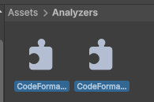
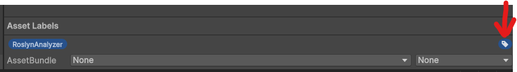
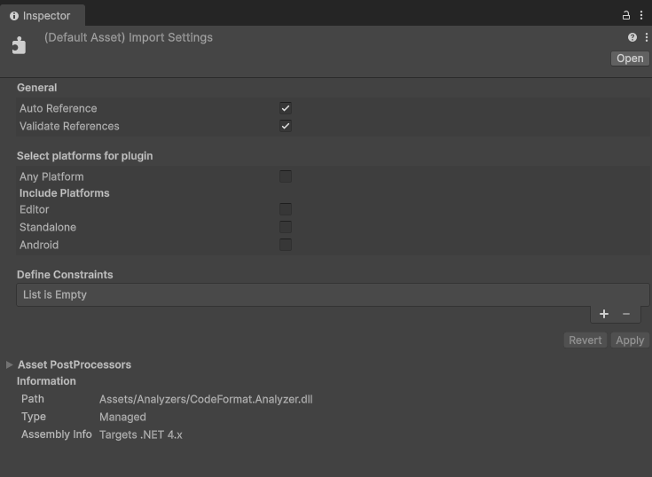

# BDU CodeFormat - Unity / C#
**A C# linter that focuses on ensuring consistency and keeping style constraints throughout a Unity project.** \
Note that it is, for the most part, made to satiate my (LokiVig's) personal style when it comes to ordering / naming schemes within a typical Unity project!

## Installation - CLI
After downloading the latest version from the releases tab, you can run the .exe in the terminal. To specify a path, you simply write the full path to the directory you want the program to analyze. **CodeFormat will also check all subdirectories within it!**

There are more launch arguments you can specify, such as `-i` / `--ignore`, specifying the name(s) of the directory/directories you wish to ignore. \
**If you do this, you must then specify the path(s) to the folders you actually want to check by typing `-p` / `--path` after the ignored name(s), then the full path to the directory/directories!**

An example of how it would be run is as follows:
```bash
.\CodeFormat.exe -i/--ignore Plugins ThirdParty -p/--path "C:\Directory\To\Check" "C:\Other\Directory\To\Check"
```

## Installation - Github Action
To use this as a Github action you can specify a workflow (e.g. `codeformat.yml` in your project's `.github\worfklows\` directory), looking something like the following:
```yaml
name: CodeFormat
on:
  push:
  pull_request:
    types: [opened, reopened, ready_for_review] # To ensure it doesn't get run twice when a commit is made to an existing PR.

jobs:
  format-check:
    runs-on: ubuntu-latest
    steps:
      - uses: actions/checkout@v4
        with:
            lfs: true
      - uses: big-dumbass-unit/codeformat@action-v1
        with:
          path: Assets/Scripts
          ignore: Plugins ThirdParty
```

## Installation - Analyzers
After downloading the latest version from the releases tab, you install them into Unity by creating a subdirectory called `Analyzers` in your main `Assets/` folder, as seen below, then dragging in `CodeFormat.Analyzer.dll` and `CodeFormat.Rules.dll`. \


The analyzers then need a specific label added to them in the Unity inspector, called `RoslynAnalyzer`, added by pressing the button highlighted in the following image. \


After that, you need to specify the following options for both .dll files in the Unity inspector as well. \


Now the installation is complete, and both Visual Studio and Unity will now alert you of any linting errors as you code / compile!
